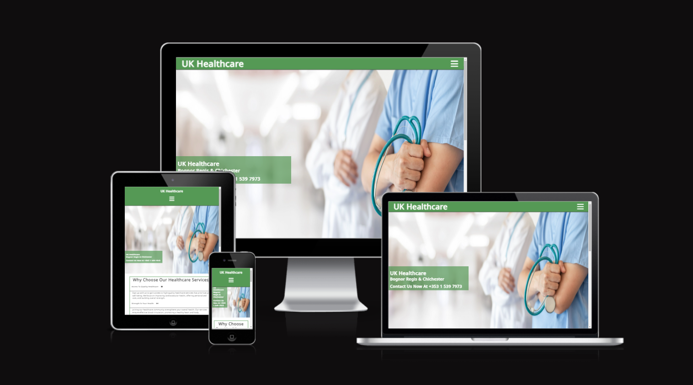
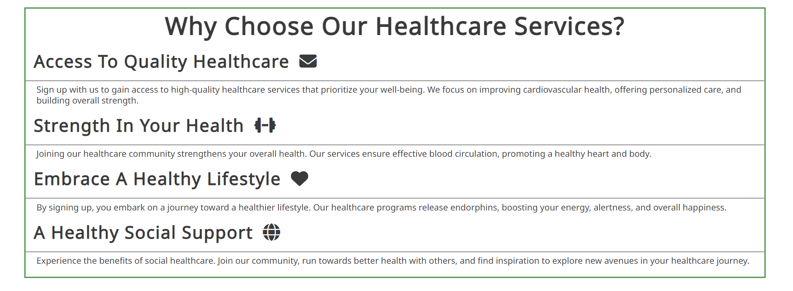
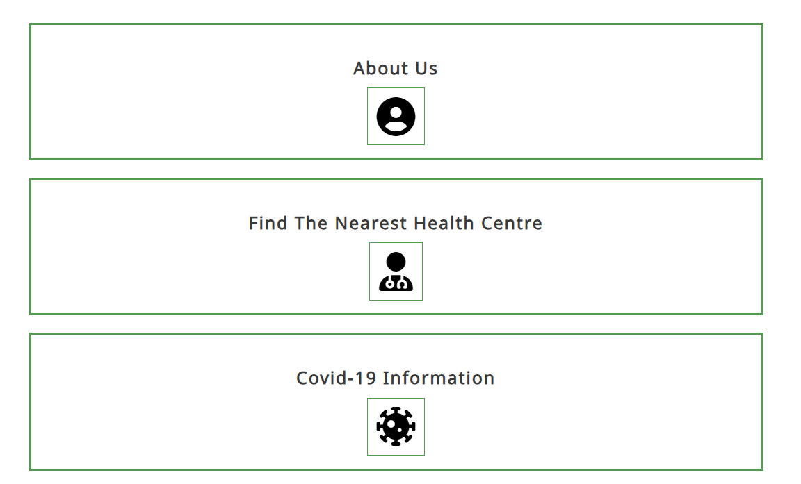
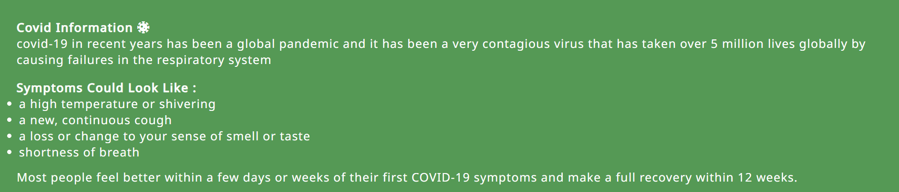
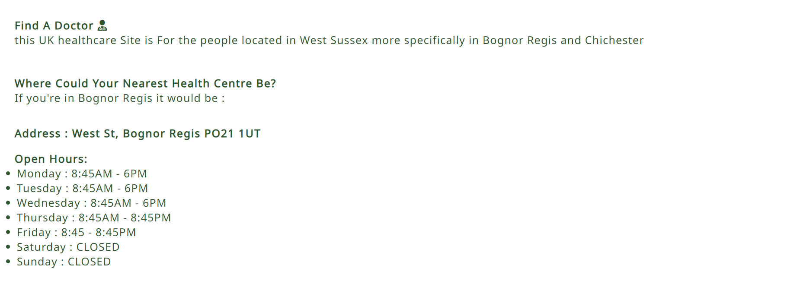
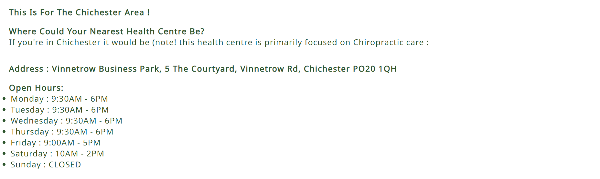
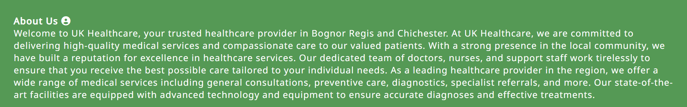
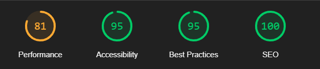

<h1 >UK Healthcare</h1>

UK healthcare is a website that is based around west sussex (specifically Bognor regis and Chichester) with the intent of giving users health advice and keeping up to date!

the user will be shown the "number" of the place at the top of the page or on the information page. users will be able to read a plethora of things such as an "about us" section where they can read about the people working these places and much more! 

<h2></h2>

[View the live project here.](https://rnxviii.github.io/Project1/)

# Features

## Navigation bar 

<ul>
 <li>Featured at the top of the page there is navigation bar that will open up once clicked on.</li>
 
 <li>the navigation bar also includes the title of the site.</li>

 <li>for simplicity i made it a dropwdown on all devices to make the pages more simple to look at.</li>

 <li>the navigation dropdown has three links to all other pages and are centered for a more simplistic look

 </ul>

<h2></h2>

## the header 

<ul>
 <li>the header has shows the name of the club aswell as a cover text showing where its located and the number of the place.</li>

 <li>the header also includes a img which also should give the user a better understanding of what this wesite is for. </li>

</ul>

 <h2 ></h2>

## why choose us section

<ul>
 <li>the why choose us section gives a short description of why to choose UK Healthcare </li>

<li>it uses icons to give the content more style and apeal to the user</li>
</ul>

<h2 ></h2>

## About us

<ul>
 <li>the about us section gives the user a picture and text giving them a bit more information about us and what services they can expect</li>

 <li> this section also has a "join us" button which directs the user towards the sign-up page</li>
</ul>

<h2 ></h2>

## Footer

<ul>
 <li>the footer has 4 simplistic icons that will send the users to a new page </li>

 <li>the footer icons and style of the footer were heavily inspired by the Love running project (more in credits)</li>

 <li> the footer will also encourage users to join via social media</li>

 <h2 ></h2>

 # information page

 ## sub navigation area
<ul>
 <li>the sub navigation area gives the user a clear idea of to find on this page and also a mor efficent way to get to the information.</li>

 <li>the sub navigation area should also help those who need accebility options. </li>
</ul>
 
 <h2 ></h2>

 ## information content

 <ul>
 
  <li>the information area consist of three main areas : Covid information , about us , "find the nearest Health centre" .</li>
 
 </ul>

 ## first section (Covid information)

 <ul>
 
  <li>the covid section gives a basic information about what users can expect from covid and some basic information about how long it lasts , the symptoms and how much damage its caused.</li>
 
 </ul>

 <h2 ></h2>

 ## second section (Where to find us)

 <ul>
  <li>the second section consists of information of where and what time the health centres are open for both Bognor regis and Chichester.</li>
 
 </ul>

 ### Bognor regis info 

 <h2 ></h2>

 ### Chichester info

 <h2 ></h2>

 ## about us section

 <ul>
 
 <li>the about us section just gives the user a more in depth description about the website and what users can expect from this , it also gives more of a description as to where it is located </li>
 
 </ul>

 <h2 align="center"></h2>

 # Sign-up page

 <ul>
 <li>the sign-up page consist of a form inside a container that has low opacity giving it a stylish feel</li>
 
 <li>the content is also aligned in the center to make it feel more infront of the user , it also helps with smaller screen sizes</li>

 <li>the form also consist of a submit button which works!</li>
 
 </ul>

<h2></h2>

# Features Left to impliment 

<ul>

<li>there are no features left to impliment.</li>

<li>the only thing i would impliment if i had time would be another page that consists of more health information with a different type of navigation bar to display more ways to get information and for UX</li>

<li>there is sadly no wireframe to this due to time purposes</li>

# Languages Used

[HTML5](https://en.wikipedia.org/wiki/HTML5)
 
[CSS3](https://en.wikipedia.org/wiki/Cascading_Style_Sheets)

# Testing

i tested this website on Chrome , Firefox and MS edge and they all work fine 

i confirmed the pages were responsive , looks optimal on standered and smaller/bigger screens

i confirmed that everything inluding the nav , header and footer were all easy to read

i confirmed that the form works like intended and that some inputs are required including the email

## Website validators

This website passed the [W3C CSS validator](https://jigsaw.w3.org/css-validator/validator)

This website also passed the [W3C validator](https://validator.w3.org/)

This website also got a good score for accebility using the lighthouse chrome extension

<h2 align="center"></h2>

# Unfixed bugs

<li>for example in the navigation there are three options , when hover over the baground color will change along with a couple of other attributes but the hover color will not extend the full width of the navigation</li>
</ul>

<h2></h2>

# Deployment

The site was deployed to GitHub pages. The steps to deploy are as follows:

<ul>
<li>In the GitHub repository, navigate to the Settings tab</li>

<li>From the source section drop-down menu, select the Master Branch</li>

<li>Once the master branch has been selected, the page will be automatically refreshed with a detailed ribbon display to indicate the successful deployment.</li>

</ul>

The live link for it can be found [here](https://rnxviii.github.io/Project1/)

# Credits 

<ul>

## content
<li>The social media links were taken from CI Love Running project
<li>NOT THE CODE but the design for the front page image was inspired by Love running project</li>
</ul>

## Libaries and tools used

Font Awesome [icons](https://fontawesome.com/)

helped me learn and create this : [w3schools](https://www.w3schools.com/)

to make the content for the information page:

Content Writer [rytr](https://rytr.me/?via=bryan-koch&gad_source=1)

## Media

Favicon - [here](https://icons8.com/icons/set/favicon-heart--static--green)

header - [here](https://www.upr.org/utah-news/2022-12-14/medical-apprenticeship-program-fills-health-worker-gaps-in-idaho)

about us(home) - [here](https://unsplash.com/s/photos/medical-background)

sign-up background - [here](https://www.template.net/web-templates/website-templates/free-medical-template/#google_vignette)
